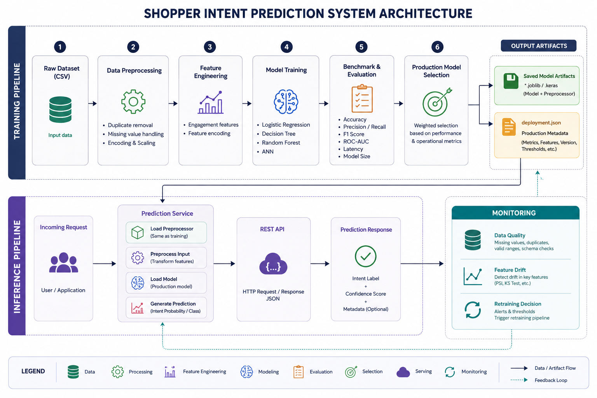

# System Design

## 1. System Overview

The Shopper Intent Prediction System is an end-to-end machine learning application designed to predict whether an online shopping session will result in a purchase. The project extends a traditional machine learning workflow into a production-oriented pipeline by incorporating automated preprocessing, feature engineering, model benchmarking, deployment, prediction, monitoring, and testing.

Rather than focusing solely on model accuracy, the system is structured to support the complete machine learning lifecycle. Each stage of the pipeline is implemented as an independent module with clearly defined responsibilities, improving maintainability, reproducibility, and ease of testing.

The application trains multiple candidate models, evaluates their predictive performance alongside operational metrics such as inference latency and model size, and automatically selects the most suitable production model using a configurable weighted scoring strategy. The selected model and preprocessing pipeline are then serialized and reused during inference to ensure consistency between training and deployment.

The project also includes a REST API for serving predictions, a monitoring module for detecting data quality issues and feature drift, and a comprehensive unit test suite to validate the behaviour of individual pipeline components.

## 2. System Architecture

The Shopper Intent Prediction System follows a modular architecture that separates the machine learning lifecycle into distinct stages, including data preprocessing, feature engineering, model training, benchmarking, deployment, inference, and monitoring. Each stage is implemented as an independent component with clearly defined responsibilities, allowing the pipeline to be developed, tested, and maintained independently.

The architecture also distinguishes between the **training pipeline**, where models are developed and selected, and the **inference pipeline**, where the selected production model serves prediction requests. Model artifacts and deployment metadata provide the interface between these two pipelines, ensuring that the same preprocessing pipeline and production model are consistently used during inference. A monitoring component continuously evaluates data quality, feature drift, and retraining conditions, providing a feedback loop that supports long-term model maintenance.

<p align="center">
  
</p>

**Figure.** High-level architecture of the Shopper Intent Prediction System showing the training pipeline, inference pipeline, deployment artifacts, and monitoring feedback loop.

## 3. Project Structure

The project is organized using a modular structure that separates source code, configuration, datasets, trained models, API services, documentation, and tests. This organization promotes maintainability, reproducibility, and ease of development by assigning each directory a specific responsibility.

```text
shopper-intent-prediction/
├── api/                         # REST API implementation (via FastApi
)
│   ├── main.py
│   └── schemas.py
│
├── configs/                     # Training configuration
│   └── training.yaml
│
├── data/
│   ├── raw/                     # Original dataset
│   └── processed/               # Processed datasets
│
├── docs/                        # Project documentation
│   └── 01_system_design.md
│
├── models/                      # Trained models and deployment artifacts
│   ├── *.joblib
│   ├── ann.keras
│   ├── benchmark_metrics.csv
│   ├── model_metrics.csv
│   ├── deployment.json
│   └── preprocessor.joblib
│
├── notebooks/                   # Exploratory data analysis
│
├── reports/                     # Monitoring reports
│   └── monitoring_report.json
│
├── src/
│   └── shopper_intent/
│       ├── benchmark.py
│       ├── evaluation.py
│       ├── features.py
│       ├── monitoring.py
│       ├── predict.py
│       ├── preprocessing.py
│       └── train.py
│
├── tests/                       # Unit tests
│   ├── test_benchmark.py
│   ├── test_features.py
│   ├── test_monitoring.py
│   ├── test_predict.py
│   ├── test_preprocessing.py
│   └── test_selection.py
│
├── README.md
└── pyproject.toml
```

Table 3.1 summarises the purpose of each major directory.

| Directory | Purpose |
|-----------|---------|
| **api/** | Implements the REST API for serving prediction requests and validating request/response schemas. |
| **configs/** | Stores configurable training parameters such as dataset paths, model settings, and benchmark weights. |
| **data/** | Contains the raw dataset and any processed data generated during the pipeline. |
| **docs/** | Project documentation, including system design and technical documentation. |
| **models/** | Stores trained models, the fitted preprocessing pipeline, benchmark results, evaluation metrics, and deployment metadata. |
| **notebooks/** | Contains exploratory data analysis and model development notebooks used during experimentation. |
| **reports/** | Stores monitoring outputs such as data quality and feature drift reports. |
| **src/shopper_intent/** | Core application source code implementing preprocessing, feature engineering, training, benchmarking, prediction, monitoring, and evaluation. |
| **tests/** | Unit tests used to verify the correctness of individual components within the pipeline. |

## 4. Component Design

The Shopper Intent Prediction System is composed of several independent modules, each responsible for a specific stage of the machine learning lifecycle. This modular design improves maintainability, simplifies testing, and enables individual components to be modified without affecting the remainder of the system.

### 4.1 Data Preprocessing

The preprocessing module prepares raw session data for machine learning by removing duplicate records, validating the input schema, encoding categorical variables, and scaling numerical features. The fitted preprocessing pipeline is serialized after training and reused during inference to ensure consistent feature transformations.

**Implementation**

- `src/shopper_intent/preprocessing.py`

---

### 4.2 Feature Engineering

The feature engineering module creates additional predictive features from the original dataset, including engagement-based attributes, and performs feature encoding required by the machine learning models.

**Implementation**

- `src/shopper_intent/features.py`

---

### 4.3 Model Training

The training module orchestrates the end-to-end model development process. After preprocessing the dataset, it balances the training data using SMOTE and trains multiple candidate models, including Logistic Regression, Decision Tree, Random Forest, and an Artificial Neural Network.

Each trained model is serialized for later evaluation and deployment.

**Implementation**

- `src/shopper_intent/train.py`

---

### 4.4 Benchmarking and Evaluation

The benchmarking module evaluates all trained models using both predictive and operational metrics. Predictive metrics include Accuracy, Precision, Recall, F1-score, and ROC-AUC, while operational metrics include inference latency and model size.

These benchmark results are used during production model selection.

**Implementation**

- `src/shopper_intent/benchmark.py`
- `src/shopper_intent/evaluation.py`

---

### 4.5 Production Model Selection

Following benchmarking, the system selects the production model using a configurable weighted scoring strategy that balances predictive performance with operational efficiency. The selected model and associated metadata are recorded in `deployment.json`.

---

### 4.6 Prediction Service

The prediction module loads the production model together with the fitted preprocessing pipeline to generate predictions for new shopping sessions. The module supports both single-record and batch predictions while ensuring feature transformations remain consistent with training.

**Implementation**

- `src/shopper_intent/predict.py`

---

### 4.7 REST API

The REST API provides an interface for external applications to submit prediction requests and receive model predictions. Input validation and response serialization are handled using Pydantic schemas.

**Implementation**

- `api/main.py`
- `api/schemas.py`

---

### 4.8 Monitoring

The monitoring module continuously evaluates incoming data for quality issues and feature drift. Based on configurable thresholds, it determines whether model retraining should be recommended, supporting long-term model reliability after deployment.

**Implementation**

- `src/shopper_intent/monitoring.py`

## 5. Data Flow

The Shopper Intent Prediction System follows a sequential workflow that transforms raw shopping session data into production-ready predictions. During training, data progresses through preprocessing, feature engineering, model development, benchmarking, and production model selection. The selected model, preprocessing pipeline, and deployment metadata are then reused during inference.

The overall data flow is illustrated in Figure 5.1.

```text
Raw Dataset
      │
      ▼
Data Preprocessing
      │
      ▼
Feature Engineering
      │
      ▼
Train/Test Split
      │
      ▼
Model Training
      │
      ▼
Benchmark & Evaluation
      │
      ▼
Production Model Selection
      │
      ├──────────────► Trained Models
      ├──────────────► Preprocessor
      └──────────────► deployment.json
                             │
                             ▼
                    Prediction Service
                             │
                             ▼
                         REST API
                             │
                             ▼
                     Prediction Response
                             │
                             ▼
                        Monitoring
                             │
                             ▼
                  Retraining Recommendation
```

During the training pipeline, the raw dataset is transformed into model-ready features before multiple candidate models are trained and benchmarked. A weighted model selection process identifies the production model, and all required artifacts—including the trained model, fitted preprocessing pipeline, and deployment metadata—are saved for deployment.

During inference, incoming requests are processed using the stored preprocessing pipeline before being passed to the production model. Prediction results are returned through the REST API, while monitoring continuously evaluates incoming data for quality issues and feature drift. If monitoring detects significant degradation or drift, the system recommends retraining, completing the machine learning lifecycle.

## 6. Design Decisions

Several design decisions were made during the development of the Shopper Intent Prediction System to improve maintainability, reproducibility, and deployment readiness. These decisions reflect common software engineering and MLOps practices while remaining appropriate for the scope of this project.

### 6.1 Modular Architecture

The project adopts a modular architecture in which preprocessing, feature engineering, model training, benchmarking, prediction, and monitoring are implemented as separate modules. Each module has a single responsibility and communicates with other components through clearly defined interfaces.

This approach offers several advantages:

- Improves code readability and maintainability.
- Enables independent unit testing of each component.
- Allows individual modules to be updated without affecting the entire pipeline.
- Simplifies future extensions, such as adding new models or monitoring capabilities.

---

### 6.2 Configuration-Driven Pipeline

Training parameters and pipeline settings are stored in `configs/training.yaml` instead of being hard-coded within the source code.

Separating configuration from implementation allows model parameters, dataset locations, and evaluation settings to be modified without changing the application logic. This improves reproducibility and makes experimentation more efficient.

---

### 6.3 Consistent Training and Inference

The fitted preprocessing pipeline is serialized after training and reused during inference alongside the selected production model.

Using the same preprocessing pipeline throughout the system ensures that incoming data undergoes identical transformations during both training and prediction, reducing the risk of training-serving skew.

---

### 6.4 Multi-Model Evaluation

Rather than training a single algorithm, the system evaluates multiple candidate models, including Logistic Regression, Decision Tree, Random Forest, and an Artificial Neural Network.

Comparing multiple algorithms provides a more objective basis for selecting a production model and demonstrates that deployment decisions are based on measured performance rather than assumptions.

---

### 6.5 Weighted Production Model Selection

The production model is selected using a configurable weighted scoring approach that considers both predictive performance and operational characteristics.

Evaluation criteria include:

- F1-score
- ROC-AUC
- Inference latency
- Model size

This strategy recognises that the most accurate model is not always the most suitable for production environments, where inference speed and resource usage are also important considerations.

---

### 6.6 Built-in Monitoring

The system includes a monitoring module that evaluates data quality, detects feature drift, and determines when model retraining should be recommended.

Although monitoring is often omitted from small machine learning projects, integrating it into the system architecture demonstrates how deployed models can be maintained over time rather than treated as static artifacts.

---

### 6.7 Test-Driven Component Validation

The project includes dedicated unit tests for feature engineering, preprocessing, benchmarking, model selection, prediction, and monitoring.

Testing individual components independently improves software reliability by ensuring that future code changes do not unintentionally alter expected behaviour. This also supports continuous integration and simplifies debugging during development.